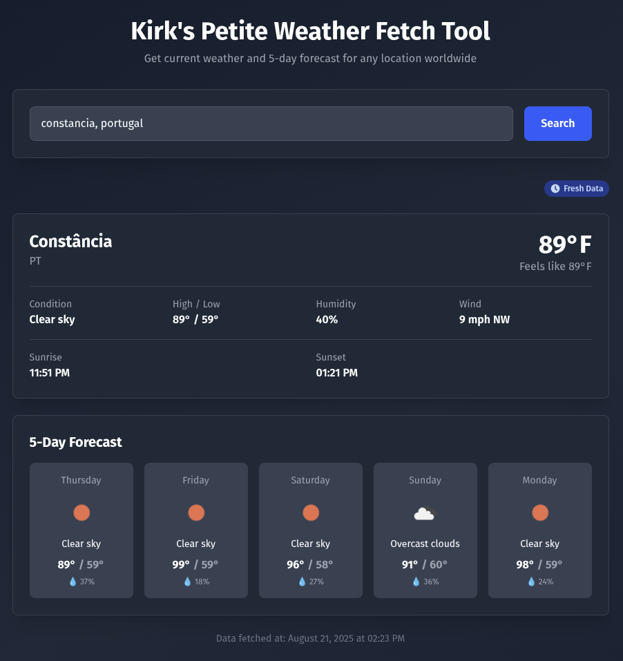

# Kirk's Weather App



This is a weather forcast fetching application built with Ruby on Rails 8. It has real-time weather data, 5-day forecasts, and caching of forecast results.
The application uses Hotwire for dynamic interactions and Tailwind CSS for a sleek dark-themed interface.
The only database dependency is SQLite, so this can readily be ran anywhere.

It leverages OpenWeatherMap for the forecasts. Their free tier for API access allow 1000 API queries per day, which is ample for an example app like this.

Notes: I cribbed a bunch of the styling from a couple other projects that I have going on, to get something sleek and attractive quickly.

## Requirements

- Ruby 3.0+
- Rails 8.0+
- SQLite3
- Node.js (for Tailwind CSS compilation)

## Setup Instructions

### 1. Clone the Repository

```bash
git clone <repository-url>
cd kirks_weather_app
```

### 2. Install Dependencies

```bash
bundle install
```

### 3. Get OpenWeatherMap API Key

This is crucial. It won't work without an API key. You can get one from OpenWeatherMap easily, however:

1. Visit [OpenWeatherMap](https://openweathermap.org/api)
2. Sign up for a free account
3. Generate an API key from your account dashboard

### 4. Configure Environment Variables

Copy the example environment file:

```bash
cp .env.example .env
```

Edit `.env` and add your OpenWeatherMap API key:

```
OPENWEATHER_API_KEY=your_actual_api_key_here
```

### 5. Setup Database

```bash
rails db:create
rails db:migrate
```

### 6. Enable Caching (Development)

```bash
rails dev:cache
```

### 7. Start the Application

The easiest way to start the app, at least in a dev environment, is to use `bin/dev` to start both Rails and Tailwind CSS compilation:

```bash
bin/dev
```

To do it manually and separately (requires 2 terminal windows/tabs):

```bash
# Terminal 1: Start Rails server
rails server

# Terminal 2: Watch for Tailwind CSS changes
rails tailwindcss:watch
```

The application defaults to running on `http://localhost:3000`.


## Architecture

It's basically the simplest thing that both works and looks good doing it.

### Services

- **`OpenweatherApi`**: Handles direct API communication with OpenWeatherMap
- **`WeatherService`**: Orchestrates weather data fetching, caching, and formatting

### Frontend

- **Hotwire**: This is the way. I actually like React, but most of the time Hotwire does everything that I could want.
- **Tailwind CSS**: I adore Tailwind. I tend to use it on most of my projects.
- **Responsive Design**: Always good to try to make things mobile-friendly right from the beginning.

## License

This project is available as open source under the terms of the MIT License.
